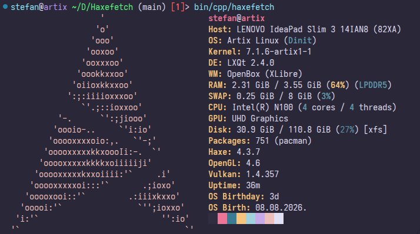
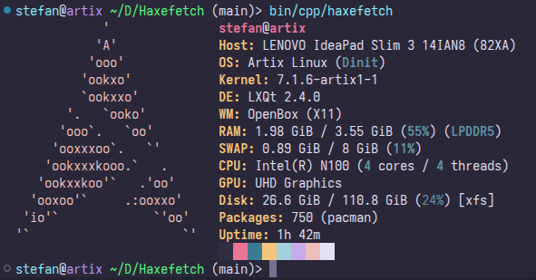
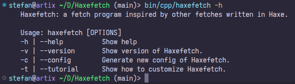
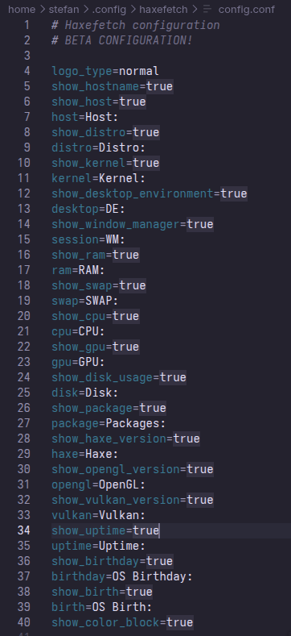

  

Haxefetch is fetch program inspired by fastfetch, neofetch, pfetch, nerdfetch, hyfetch, and so on written in Haxe. [Don't know what's Haxe? Read more](https://haxe.org/) and [learn Haxe if you don't know!](https://haxe.org/documentation/introduction/)

  

  

(Haxefetch preview)

  

(Haxefetch commands)

  

(Configuring Haxefetch with .conf support)

## Dependencies
 - `inxi` - Required to show RAM type (optional / not optional)
 - `vulkaninfo` and `vulkantools` - Required to show Vulkan version (optional / not optional)
 - `glxinfo` and `mesa-utils` - Required to show OpenGL version (optional / not optional)

## How to use this?

If you want to use, follow this:

    
Getting a binary

If you prefer binary,  -> [go here](https://github.com/ACoolioDude/Haxefetch/blob/main/binary/haxefetch) <- or -> [open GH releases](https://github.com/ACoolioDude/Haxefetch/releases) <-

    
Getting Haxe and it's dependencies

1. Install dependencies.
   - Debian/Ubuntu: `apt-get install haxe inxi mesa-utils vulkaninfo vulkan-tools git g++`
   - Fedora/RHEL/RPM: `dnf install haxe inxi mesa-dri-drivers vulkan-headers vulkan-loader vulkan-tools git g++`
   - openSUSE Leap/Tumbleweed: `zypper install inxi haxe Mesa git g++`
   - Arch: `pacman -S base-devel haxe inxi mesa mesa-utils vulkan-headers vulkan-tools git` (note for Arch users. If you get `cannot create Vulkan instance` error or it prints N/A, you need to install GPU Vulkan driver for your iGPU/dGPU specifically)
   - Gentoo: `emerge --ask --verbose dev-lang/haxe sys-apps/inxi media-libs/mesa x11-apps/mesa-progs media-libs/vulkan-loader dev-util/vulkan-headers dev-util/vulkan-tools dev-vcs/git sys-devel/gcc` (if you have packages that are masked, [unmask them](https://wiki.gentoo.org/wiki/Knowledge_Base:Unmasking_a_package))
2. Clone my repo.
   - `git clone https://github.com/ACoolioDude/Haxefetch.git`
2. Setup development.
   - `cd Haxefetch` > `haxelib setup` (requires Haxe!) > Set haxelib environent to Haxefetch folder `home/$USER/Haxefetch/.haxelib` > install HXCPP `haxelib install hxcpp`
3. Compile Haxefetch.
   - `haxe build.hxml`

## Note for Arch Linux users
I gave PKGBUILD of this because i am planning to upload this on AUR, but registering is not currently available, so you can build this for yourself
1. Install `base-devel` package
2. Switch to `src/arch` directory inside of Haxefetch
3. Run `makepkg -si` (it will install package inside of `/usr/bin` folder)
4. Now you have local haxefetch binary on your Arch system

